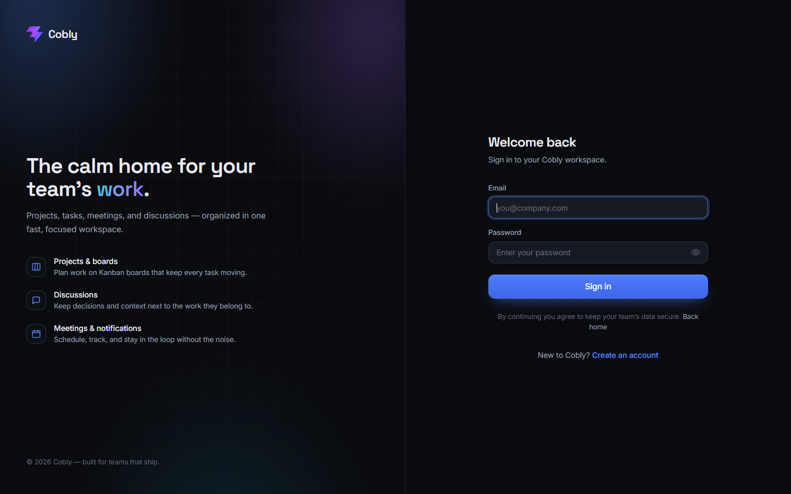
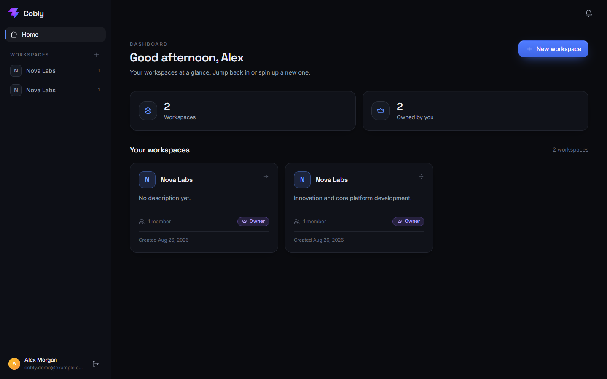
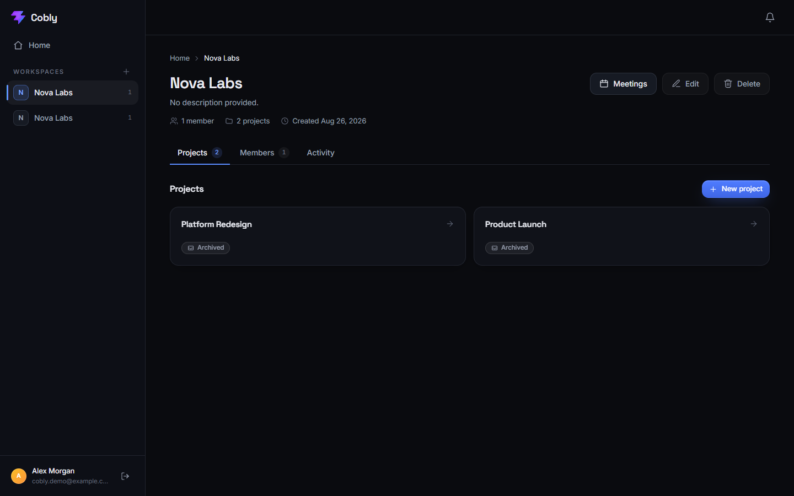
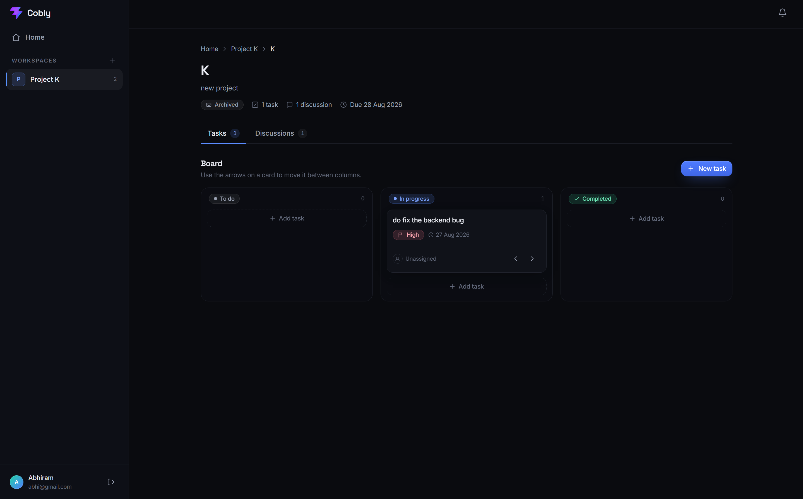
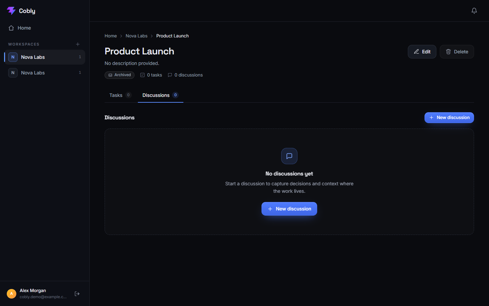
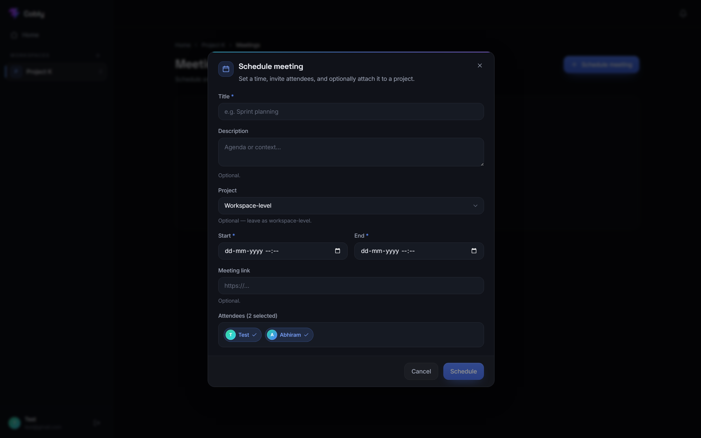
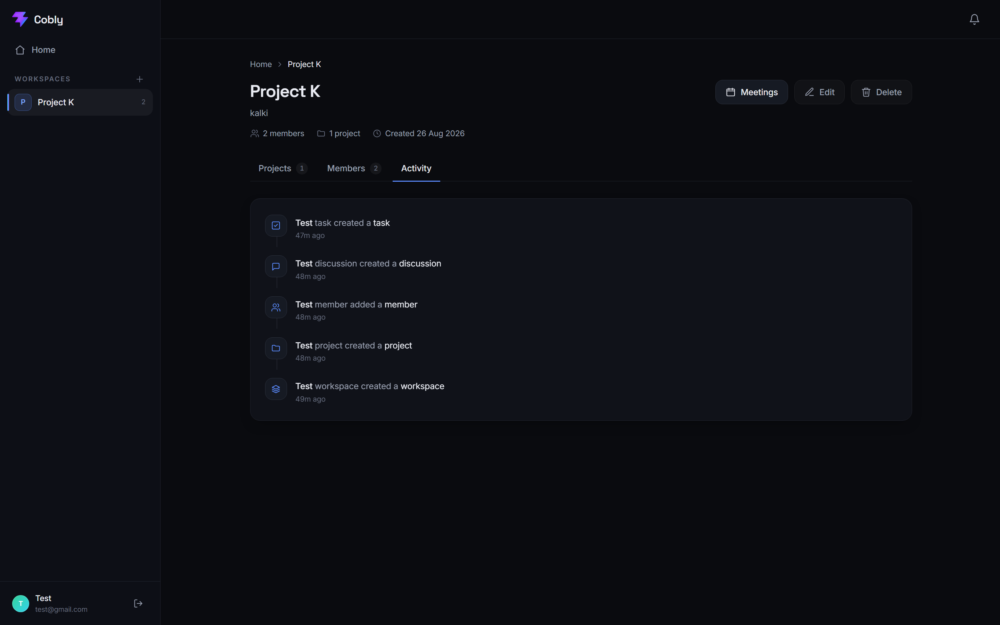
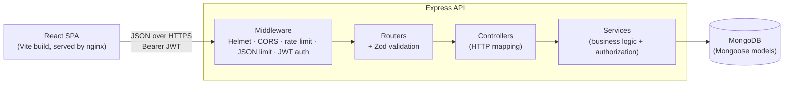

# Cobly

**Cobly** is a collaborative workspace and project-management API and web app — think lightweight team hub where people organize work into workspaces, projects, tasks, discussions, and meetings, with role-based access and an activity feed. It is built as a TypeScript monorepo with an Express + MongoDB REST API and a React single-page front end.

<p>
  
  
  
  
  
  
</p>

## ✨ Product Preview

Cobly is a futuristic collaborative workspace for managing projects, tasks, discussions, meetings, notifications, and activity.

### 🔐 Authentication



### 📊 Dashboard



### 🏢 Workspace



### 📋 Task Management



### 🤝 Collaboration



### 📅 Meeting



### 📜 Activity & Audit Trail



---

## Table of contents

- [Features](#features)
- [Tech stack](#tech-stack)
- [Architecture](#architecture)
- [Repository layout](#repository-layout)
- [Quick start (local)](#quick-start-local)
- [Quick start (Docker)](#quick-start-docker)
- [Environment variables](#environment-variables)
- [API overview](#api-overview)
- [Testing](#testing)
- [Security](#security)
- [Continuous integration](#continuous-integration)
- [Documentation](#documentation)
- [License](#license)

---

## Features

Cobly is organized around **workspaces**. Every piece of data belongs to a workspace, and access is always checked against workspace membership and role.

- **Authentication** — email/password registration and login, secured with bcrypt password hashing and stateless JWT access tokens.
- **Workspaces** — create, list, read, update, and delete workspaces. The creator becomes the owner automatically.
- **Membership & roles** — each workspace has `owner` and `member` roles. Owners can add and remove members; the owner cannot be removed or demoted out of existence.
- **Projects** — group work inside a workspace, with a status (`planned`, `active`, `completed`, `archived`) and an optional deadline.
- **Tasks** — created inside a project, with an optional assignee (must be a workspace member), a status (`todo`, `in_progress`, `completed`), a priority (`low`, `medium`, `high`), and an optional due date. Tasks can be filtered by status, priority, and assignee.
- **Discussions & comments** — threaded discussions inside a project, each with its own comment thread.
- **Meetings** — schedule meetings in a workspace (optionally tied to a project), with an organizer, attendees, start/end times, a status, and an optional meeting link.
- **Activity feed** — mutations are recorded as immutable activity entries so a workspace has an auditable, chronological history.
- **Notifications** — per-user notifications (for example, being added to a workspace) that can be marked read individually or all at once.

The React front end presents these features through a responsive dashboard: an off-canvas workspace sidebar on small screens, a workspace overview, project and discussion detail pages, meeting views, a notifications panel, and dedicated loading / empty / error / not-found states.

## Tech stack

| Layer | Technologies |
| --- | --- |
| **Backend** | Node.js 22, Express 5, TypeScript (strict), Mongoose 9 / MongoDB, JSON Web Tokens, bcrypt, Zod, Helmet, CORS, express-rate-limit |
| **Frontend** | React 19, TypeScript, Vite 8, React Router 7, Tailwind CSS v4 (`@tailwindcss/vite`), oxlint |
| **Testing** | Jest, ts-jest, Supertest, `mongodb-memory-server` (in-process MongoDB) |
| **Tooling / infra** | Docker (multi-stage builds), Docker Compose, GitHub Actions, nginx (SPA static serving) |

## Architecture

Cobly is a two-package monorepo. The backend is a layered REST API; the frontend is a Vite-built SPA that talks to it over HTTP.



The backend follows a strict **routes → validation → controllers → services → models** flow:

- **Routers** (`src/routes`) declare paths and attach a Zod schema to each route via a `validateRequest` middleware, so invalid input is rejected before any handler runs. Resource routers are nested to mirror ownership — projects live under a workspace, tasks and discussions under a project, comments under a discussion.
- **Controllers** (`src/controllers`) are thin: they read the validated request, call a service, and translate the result (or a known error string) into an HTTP status and JSON body.
- **Services** (`src/services`) hold all business logic **and all authorization**. Every resource service loads the workspace, resolves the caller's membership/role, and scopes each query to its parent (`findOne({ _id, workspaceId })`, `findOne({ _id, projectId })`, …). This single pattern is what enforces workspace isolation and prevents cross-tenant access (IDOR).
- **Models** (`src/models`) are Mongoose schemas. Services never return raw documents; they map them to `Safe*` DTOs that strip internal fields (for example, password hashes and the raw member array are never serialized).

This layering keeps authorization in exactly one place, makes controllers trivial to read, and means new resources are added by following the same template.

## Repository layout

```
cobly/
├── backend/                 # Express + TypeScript REST API
│   ├── src/
│   │   ├── config/          # env loading & validation, DB connect/disconnect
│   │   ├── controllers/     # thin HTTP handlers
│   │   ├── middleware/      # auth, validation, logging, error & 404 handlers
│   │   ├── models/          # Mongoose schemas
│   │   ├── routes/          # routers + Zod schemas (nested by ownership)
│   │   ├── services/        # business logic + authorization
│   │   ├── types/           # TypeScript augmentations (e.g. req.user)
│   │   ├── app.ts           # Express app assembly (middleware order)
│   │   └── server.ts        # bootstrap + graceful shutdown
│   ├── tests/               # Jest + Supertest suites (in-memory MongoDB)
│   └── Dockerfile
├── frontend/                # React + Vite SPA
│   ├── src/
│   │   ├── pages/           # route-level screens
│   │   ├── layouts/         # dashboard / main layouts
│   │   ├── components/      # reusable UI (e.g. ProtectedRoute)
│   │   ├── hooks/           # useAuth context/provider
│   │   ├── services/        # API client + typed per-resource modules
│   │   ├── types/           # shared TypeScript types
│   │   └── utils/           # helpers (e.g. datetime-local handling)
│   ├── nginx.conf           # SPA fallback for production serving
│   └── Dockerfile
├── docs/                    # API.md and DEVELOPMENT.md
├── .github/workflows/ci.yml # CI: build, lint, test, docker
├── docker-compose.yml       # mongo + backend + frontend
└── DOCKER.md                # containerization & deployment guide
```

## Quick start (local)

**Prerequisites:** Node.js 22+, npm, and a running MongoDB instance (local `mongod` or a connection string to a hosted cluster).

**1. Clone and install**

```bash
git clone https://github.com/<your-account>/cobly.git
cd cobly
```

**2. Start the backend**

```bash
cd backend
cp .env.example .env          # then edit .env — set a strong JWT_SECRET (>= 32 chars)
npm install
npm run dev                   # starts the API on http://localhost:5000
```

**3. Start the frontend** (in a second terminal)

```bash
cd frontend
cp .env.example .env          # VITE_API_URL defaults to http://localhost:5000/api
npm install
npm run dev                   # starts Vite on http://localhost:5173
```

Open the printed Vite URL, register an account, and you are in.

> **Note:** the API refuses to start if `JWT_SECRET` is missing or shorter than 32 characters. This is intentional — it prevents accidentally running with an insecure signing key.

## Quick start (Docker)

The whole stack (MongoDB + API + nginx-served frontend) runs with Docker Compose:

```bash
cp .env.docker.example .env   # set a strong JWT_SECRET
docker compose build
docker compose up -d
# Frontend: http://localhost:8080   API: http://localhost:5000
```

See **[DOCKER.md](DOCKER.md)** for the full containerization and deployment guide, including image details, health checks, and the CI Docker job.

## Environment variables

**Backend** (`backend/.env`):

| Variable | Required | Default | Description |
| --- | --- | --- | --- |
| `JWT_SECRET` | **Yes** | — | Signing key for JWTs. Must be at least 32 characters; the process exits on startup if it is missing or too short. |
| `PORT` | No | `5000` | Port the API listens on. |
| `MONGODB_URI` | No | `mongodb://localhost:27017/cobly` | MongoDB connection string. |
| `JWT_EXPIRES_IN` | No | `1h` | Access-token lifetime (e.g. `1h`, `24h`). |
| `FRONTEND_URL` | No | `http://localhost:5173` | Allowed CORS origin in production. |
| `NODE_ENV` | No | `development` | `development`, `production`, or `test`. |

**Frontend** (`frontend/.env`):

| Variable | Required | Default | Description |
| --- | --- | --- | --- |
| `VITE_API_URL` | No | `http://localhost:5000/api` | Base URL the browser uses to reach the API. **Must include the `/api` suffix.** Baked into the bundle at build time. |

Only `*.example` templates are committed; real `.env` files are gitignored and must never be checked in.

## API overview

- **Base URL:** `/api`
- **Auth:** send `Authorization: Bearer <token>` on every protected route. Obtain a token from `POST /api/auth/login`.
- **Success envelope:** responses wrap the payload under a named key, e.g. `{ "workspace": { … } }` or `{ "tasks": [ … ] }`. Deletions return `{ "success": true, "message": "…" }`.
- **Error envelope:** `{ "error": { "message": "…" } }` (a `stack` field is added only outside production).

| Area | Representative endpoints |
| --- | --- |
| Health | `GET /api/health`, `GET /api/health/readiness` |
| Auth | `POST /api/auth/register`, `POST /api/auth/login` |
| Users | `GET /api/users/me` |
| Workspaces | `GET/POST /api/workspaces`, `GET/PATCH/DELETE /api/workspaces/:workspaceId` |
| Members | `GET/POST /api/workspaces/:workspaceId/members`, `DELETE …/members/:userId` |
| Projects | `GET/POST /api/workspaces/:workspaceId/projects`, `…/projects/:projectId` |
| Tasks | `GET/POST …/projects/:projectId/tasks`, `…/tasks/:taskId` |
| Discussions | `…/projects/:projectId/discussions`, `…/discussions/:discussionId` |
| Comments | `…/discussions/:discussionId/comments`, `…/comments/:commentId` |
| Meetings | `GET/POST /api/workspaces/:workspaceId/meetings`, `…/meetings/:meetingId` |
| Activity | `GET /api/workspaces/:workspaceId/activity` |
| Notifications | `GET /api/notifications`, `PATCH …/read-all`, `PATCH …/:id/read`, `DELETE …/:id` |

The complete reference — every route, its validation rules, and example requests/responses — is in **[docs/API.md](docs/API.md)**.

## Testing

The backend has a Jest + Supertest suite that runs against an in-process MongoDB (`mongodb-memory-server`), so no external database is needed to run the tests.

```bash
cd backend
npm test                 # run the suite
npm run test:coverage    # run with a coverage report
```

Coverage spans authentication, workspace membership and role enforcement, cross-workspace isolation, mass-assignment protection, input validation, rate limiting, security headers, and the projects/tasks/discussions/meetings/notifications/activity flows.

## Security

Security was a first-class concern throughout:

- **Passwords** are hashed with bcrypt (per-user salt); plaintext is never stored or logged.
- **JWT** signing requires a secret of at least 32 characters, enforced at startup.
- **Authorization** lives in the service layer: every request is scoped to the caller's workspace membership and role, which enforces tenant isolation and blocks IDOR-style access to other workspaces' data.
- **Input validation** with Zod runs on the body and params of every mutating route.
- **Mass-assignment** is prevented by never binding request bodies directly to models and by returning hand-built `Safe*` DTOs.
- **HTTP hardening** via Helmet (secure headers), a locked-down CORS origin in production, global and stricter auth-specific rate limiting, and a 100 kB JSON body limit.
- **Secrets** stay out of the repository — only `*.example` env templates are committed.

## Continuous integration

Every push and pull request to `main` runs **[.github/workflows/ci.yml](.github/workflows/ci.yml)**, which:

1. builds and type-checks the backend and runs the full test suite with coverage,
2. lints, type-checks, and production-builds the frontend,
3. runs repository-hygiene checks (no tracked `.env` files, no `@ts-ignore` escapes in source),
4. validates the Compose file and builds both Docker images.

The workflow requests only `contents: read` permissions and never publishes images or writes back to the repository.

## Documentation

- **[docs/API.md](docs/API.md)** — full REST API reference.
- **[docs/DEVELOPMENT.md](docs/DEVELOPMENT.md)** — architecture deep-dive and contributor guide.
- **[DOCKER.md](DOCKER.md)** — containerization and deployment.

## License

Released under the **ISC** license (as declared in `backend/package.json`).
